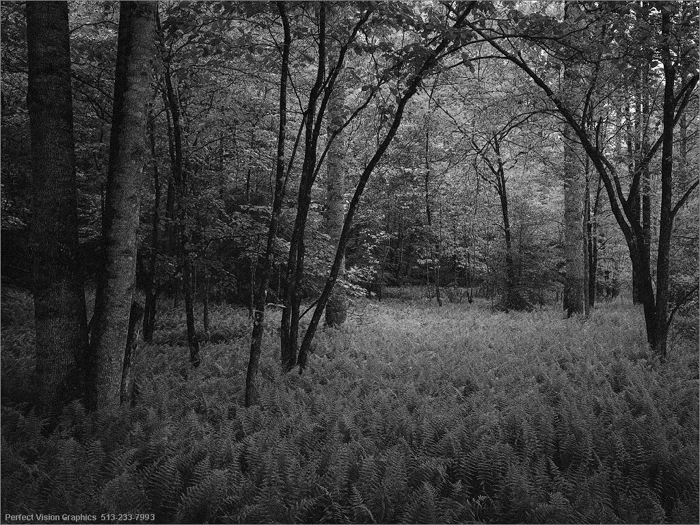

# BitMap to monochrome
## University project - 1 term

* input.bmp - default input file
* output.bmp - default putput file
* cmake-build-debug - файлы Clion

## Пример работы
#### *Input*

#### *Output*

