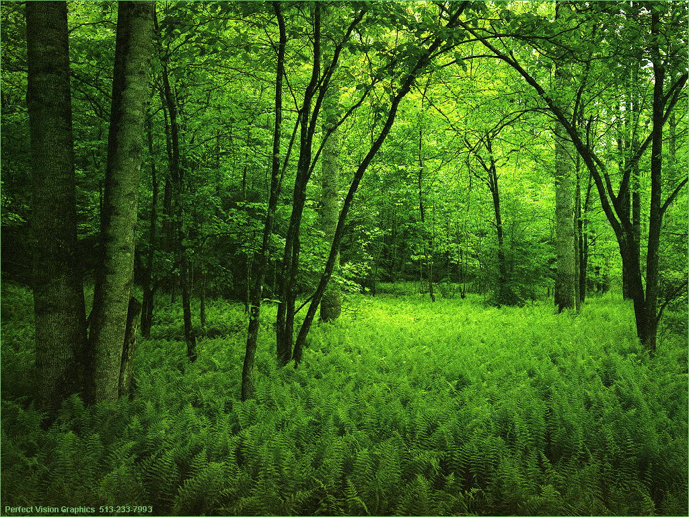
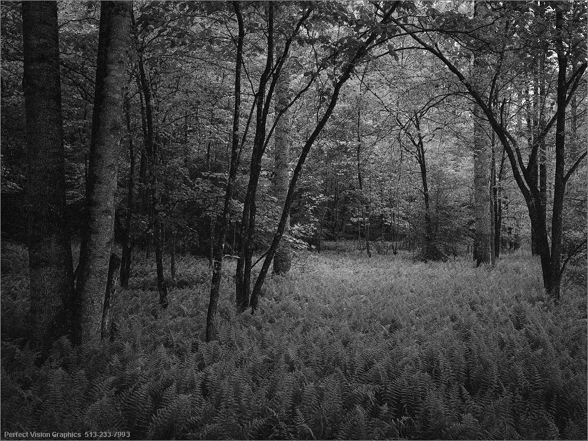

# BMP
## University project

* BMP.exe - исполняемый файл
* input.bmp - входная картинка
* img.bmp - монохромная картинка
* cmake-build-debug - файлы Clion

## Пример работы
#### *Input*

#### *Output*

